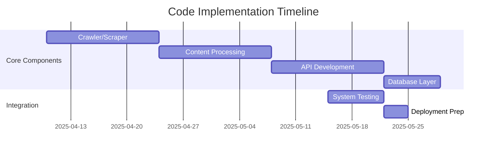

# Development Focus - Code Implementation Only

## Core Development Priorities

1. **Web Crawler/Scraper System**
- Python-based crawler with configurable:
  - Start URLs
  - Crawl depth
  - Breadth/depth first options
- BeautifulSoup/Scrapy integration
- Bloom filter implementation

2. **Content Processing**
- NLP text analysis (NLTK/spaCy)
- Automated product generation:
  - PDF creation (ReportLab)
  - eBook formatting
  - Blog post templates

3. **API Interfaces**
- FastAPI endpoints for:
  - Product management
  - Affiliate integration
  - Marketing automation

4. **Database Models**
- MongoDB schemas for:
  - Products
  - Affiliate programs
  - User data
  - Transactions

## Implementation Roadmap

## Technical Specifications
- Python 3.10+
- FastAPI 0.95+
- MongoDB 6.0+
- Docker containers for deployment
- GitHub repository for version control