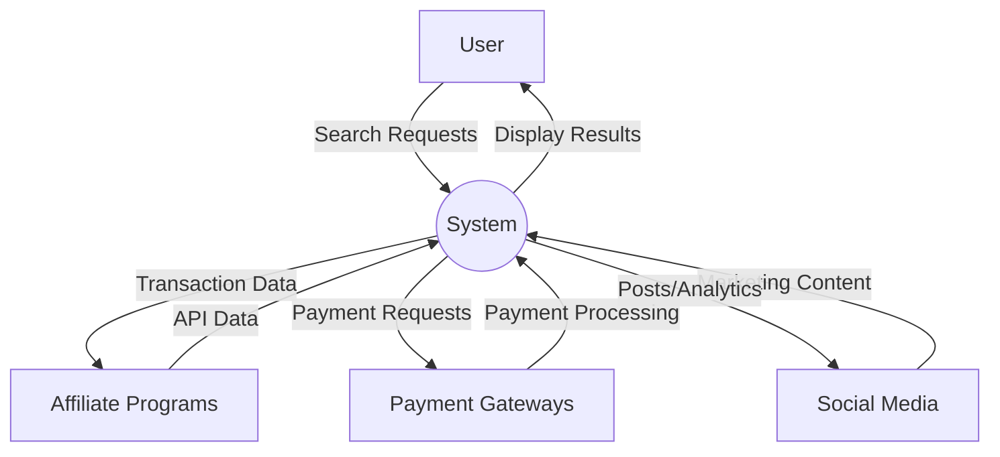
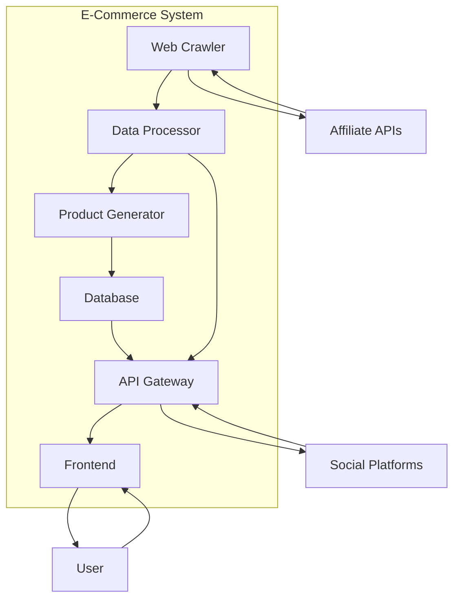
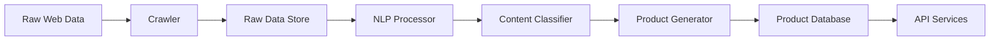
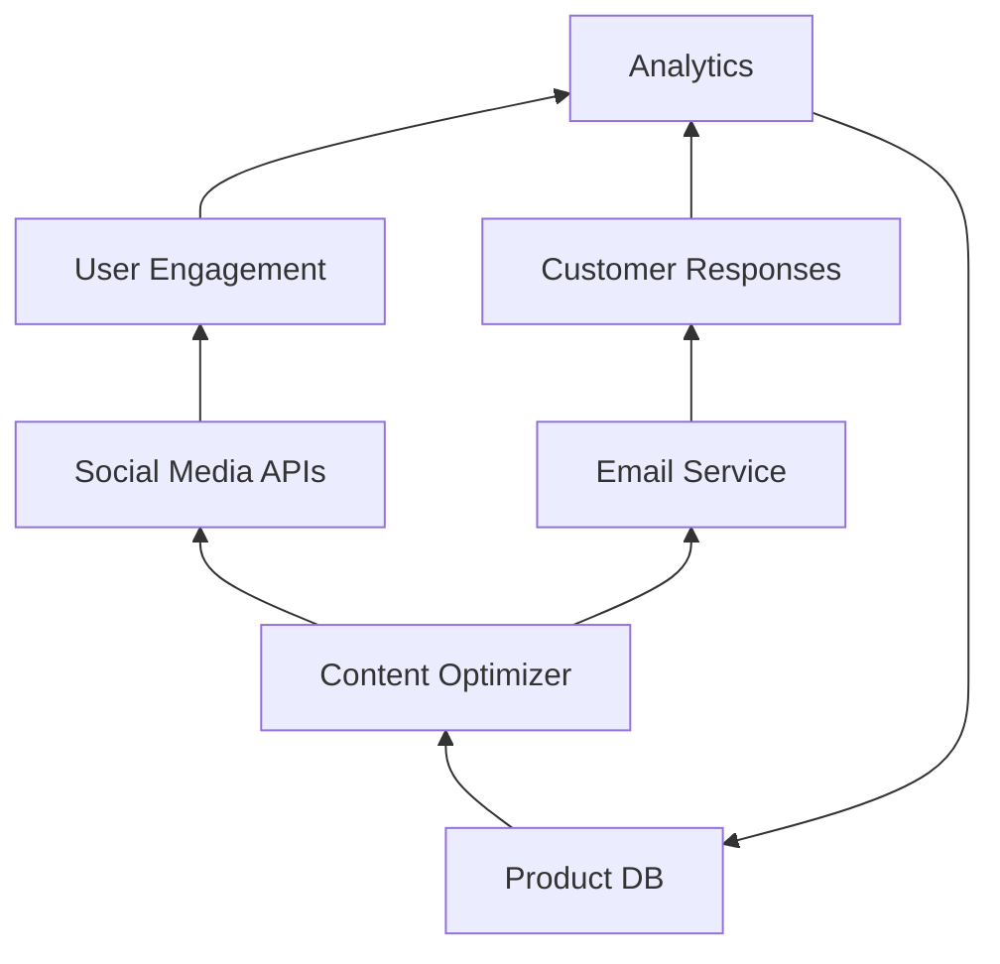

# E-Commerce System Data Flow Diagrams

## Level 0 - Context Diagram

## Level 1 - Main System Flow

## Data Processing Flow

## Marketing Data Flow

## Key Data Stores
1. **Raw Data Repository**
   - Unprocessed web content
   - Affiliate program feeds
   - Social media streams

2. **Processed Content**
   - Classified data
   - Tagged content snippets
   - Product components

3. **Product Catalog**
   - Finished digital products
   - Metadata and relationships
   - Pricing information

4. **Transaction Records**
   - Customer purchases
   - Affiliate payments
   - Marketing performance