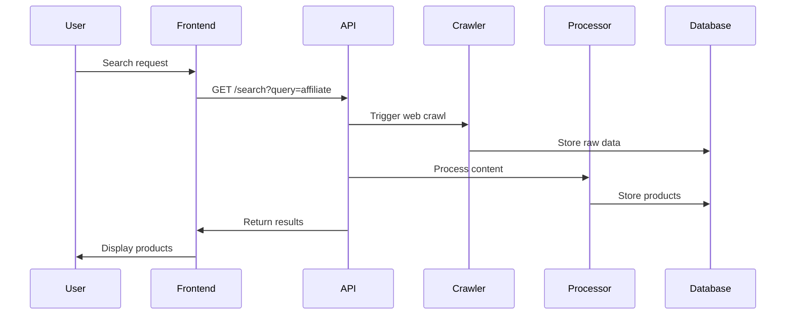
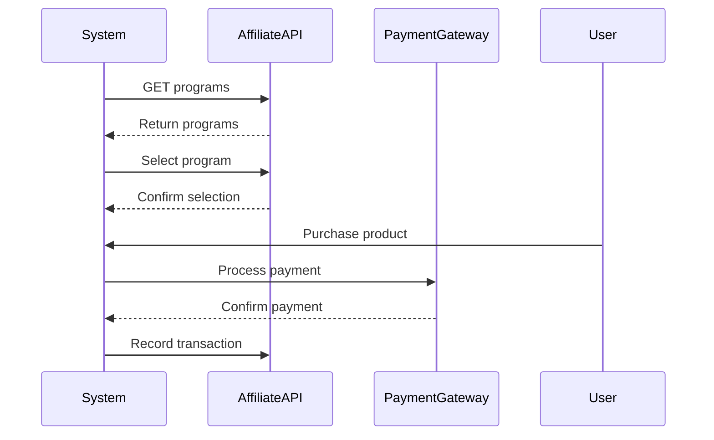
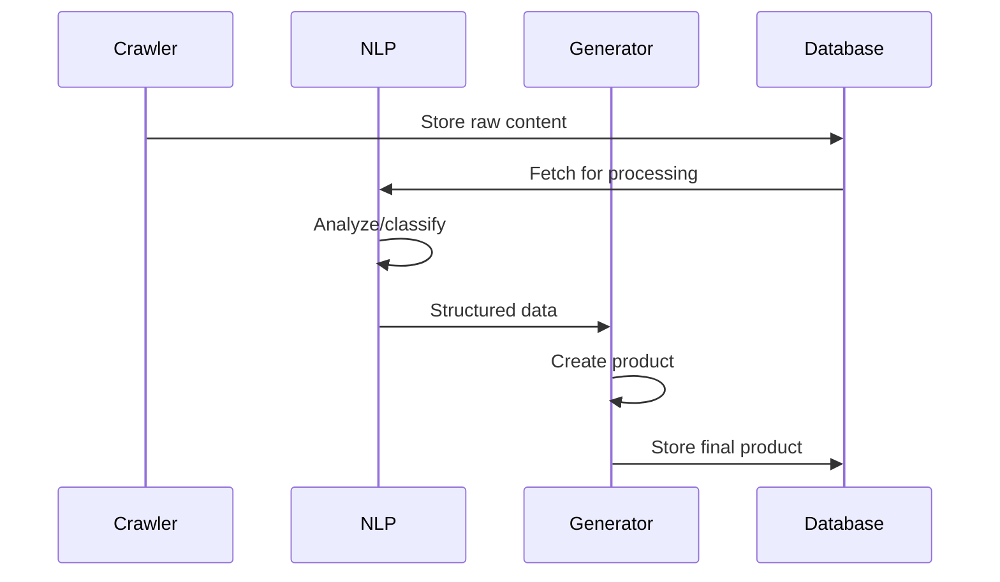
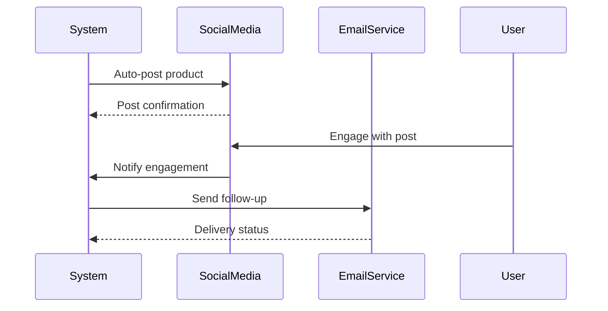

# E-Commerce System Sequence Diagrams

## Main System Flow

## Affiliate Integration Flow

## Content Processing Flow

## Marketing Automation Flow

## Key Components
1. **User Interactions**: Search, purchase, engagement
2. **System Processes**: Crawling, processing, generation
3. **External Services**: Affiliate APIs, payment gateways
4. **Marketing Channels**: Social media, email