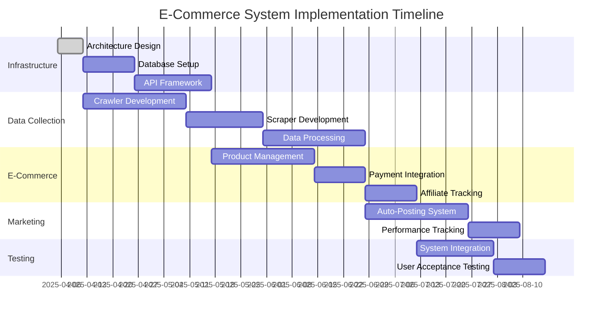

# Automatic E-Commerce System - Technical Scope

## System Overview
A fully automated e-commerce system that:
1. Crawls/scrapes the web for affiliate programs and content
2. Processes data into digital products (e-books, PDFs, etc.)
3. Manages affiliate/reseller program integration
4. Automates marketing across multiple channels
5. Handles transactions and tracking

## Core Components

### 1. Data Collection Layer
- Web crawlers with configurable parameters (start URL, depth, breadth/depth first)
- Content scrapers with filtering capabilities
- Support for structured/semi-structured/unstructured data
- Seed URL management system
- Bloom filters for efficient crawling

### 2. Processing Layer
- NLP models for content analysis and classification
- Text summarization for product creation
- Content transformation pipelines
- Affiliate program profitability analysis
- Automated product generation (PDFs, ebooks, blog posts)

### 3. API Layer
- API Creator/Connector/Integrator/Manager systems
- Integration with 14,000-15,000 public APIs
- Marketing automation (Twitter, WordPress, social media)
- Auto-posting and response systems
- Email marketing/auto-responder integration

### 4. E-Commerce Layer
- Product catalog management
- Shopping cart and payment processing
- Transaction tracking
- Affiliate program tracking
- Customer management

### 5. Administration Layer
- System configuration and management
- Marketing performance analytics
- Content management
- User management and authentication

## Technical Stack
- **Backend**: Python (primary) with PHP alternative
- **Frontend**: JavaScript
- **Database**: MongoDB (primary) with SQL support
- **Search**: Custom search APIs
- **Authentication**: Multi-tiered (basic to financial-grade)

## Architecture
Three-layer architecture:
1. **Interface Layer**: XML-based application interfaces
2. **Migration Layer**: Data movement between web and application
3. **Application Layer**: Core business logic and processing

## Implementation Timeline

## Key Requirements
- Maximum automation using AI/ML where possible
- Support for B2C business model
- Integration with major affiliate programs (ClickBank, WarriorPlus, JVZoo)
- Automated marketing across multiple channels
- Comprehensive tracking and analytics