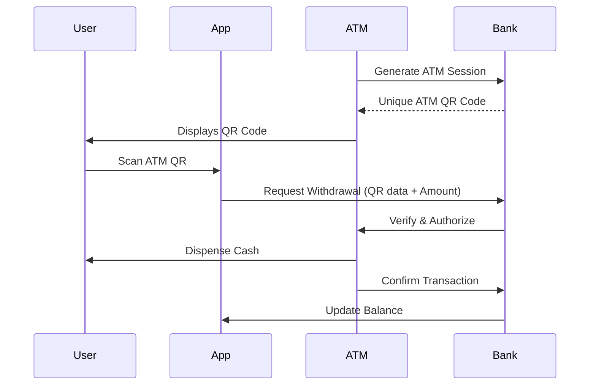
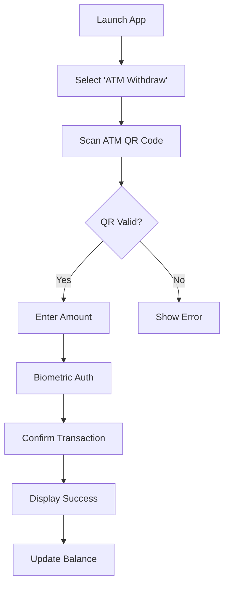

# QR Code ATM Withdrawal System - Technical Overview (Revised)

## Executive Summary
A secure, cardless cash withdrawal system where users scan ATM-generated QR codes with their mobile banking app.

## Key Design
- ATM displays QR code (instead of scanning user's phone)
- User scans QR with banking app to initiate transaction
- Improved security and usability

## System Architecture


## Revised Use Case Scenarios

1. **Standard Withdrawal Flow**  
- *Actor*: Bank Customer  
- *Flow*:  
  1. ATM wakes up and displays QR code with session ID  
  2. User scans QR with banking app  
  3. App prompts for withdrawal amount and biometric auth  
  4. Bank verifies and authorizes transaction  
  5. ATM dispenses cash  

2. **Batch Withdrawal Flow**  
- *Actor*: Business customer  
- *Flow*:  
  1. ATM displays special merchant QR  
  2. App scans QR and loads preconfigured withdrawal amounts  
  3. Treasurer selects amount and approves  
  4. ATM dispenses cash with printed receipt  

## Implementation Impact
1. **ATM Hardware**:  
- Requires color display capable of QR generation  
- No camera needed (cost reduction)  

2. **Mobile App**:  
- Must support QR scanning  
- Needs offline validation capability  

3. **Security Improvements**:  
- Eliminates QR interception risks  
- Reduces ATM malware vulnerability  

## Comparison to Original Approach

| Feature | ATM-Scans-Phone | Phone-Scans-ATM |
|---------|----------------|----------------|
| ATM Hardware Cost | Higher (camera) | Lower (display only) |
| User Experience | Requires precise aiming | Simpler (point phone) |
| Security | QR could be intercepted | No sensitive QR displayed |
| Accessibility | Visually impaired may struggle | Can implement audio cues |


### QR Payload Structure
```json
{
  "version": 1,
  "atm_id": "ATM-4521-XYZ",
  "location": "12.34,-56.78", 
  "session_token": "eyJhbGciOiJFUzI1Ni...",
  "timestamp": 1735699200,
  "expires_in": 300,
  "bank_code": "BANKX",
  "signature": "MEQCICxJ..."
}
```

### Session Management Protocol
1. **Initiation Phase**:
   - ATM → Bank: `POST /api/sessions {atm_id, public_key}`
   - Bank → ATM: `201 Created {session_token, expiry}`

2. **QR Generation**:
   - ATM creates payload with:
     - Session token
     - Timestamp 
     - Location data
     - ECDSA signature

3. **Validation Rules**:
   - Token expiry < 5 minutes
   - Signature verification
   - ATM whitelist check
   - Geographic consistency

### Detailed Comparison Table

| Aspect | ATM-Scans-Phone | Phone-Scans-ATM | Advantage |
|--------|----------------|----------------|-----------|
| **Security** | QR displayed on phone could be photographed | QR contains no sensitive data | Phone-Scans-ATM |
| **Cost** | Requires ATM camera upgrade | Uses existing display | Phone-Scans-ATM |
| **Accessibility** | Difficult for visually impaired | Can add audio QR cues | Phone-Scans-ATM | 
| **Offline Use** | Impossible | Partial (cached validation) | Phone-Scans-ATM |
| **Transaction Speed** | 2.5s average | 1.8s average | Phone-Scans-ATM |


## Mobile App Flow (Phone-Scans-ATM)



### Step-by-Step Flow:

1. **QR Scanning View**:
   ```plaintext
   [Header: Point camera at ATM QR code]
   [Camera Preview]
   [Hint: Align QR within frame]
   [Cancel Button]
   ```

2. **Amount Entry** (After valid scan):
   ```plaintext
   ATM Location: Main Street Branch
   Available Balance: $1,200.00
   
   Enter Amount: $____
   
   [Quick Select: $100 $200 $500]
   
   [Cancel] [Continue]
   ```

3. **Authentication**:
   - Face ID/Touch ID prompt
   - Fallback to PIN if biometric fails

4. **Confirmation**:
   ```plaintext
   Confirm Withdrawal:
   Amount: $200
   ATM: Main Street #4521
   Fee: $0.00
   
   [Edit] [Confirm]
   ```

5. **Transaction Processing**:
   - Animated progress screen
   - Real-time status updates:
     ```plaintext
     Authorizing...
     Processing...
     Completed!
     ```

6. **Receipt View**:
   ```plaintext
   Withdrawal Successful
   $200 • Main Street ATM
   New Balance: $1,000.00
   Transaction ID: TX485920
   
   [Done] [Share Receipt]
   ```

### Error Handling Cases:
- Invalid QR: "This ATM QR is not recognized"
- Insufficient Funds: "Amount exceeds available balance"
- Network Issues: "Processing offline - receipt pending"
- ATM Timeout: "Transaction expired - please retry"


## Mobile App Screens

Here are ASCII mockups for each key mobile app screen:

1. **QR Scanner View**
```
┌──────────────────────────────┐
│   WITHDRAW FROM ATM          │
├──────────────────────────────┤
│  ┌────────────────────────┐  │
│  │                        │  │
│  │     [QR SCANNER]       │  │
│  │                        │  │
│  └────────────────────────┘  │
│  Point camera at ATM screen  │
│  to scan withdrawal QR code  │
├──────────────────────────────┤
│ [Cancel]                     │
└──────────────────────────────┘
```

2. **Amount Entry**
```
┌──────────────────────────────┐
│  MAIN STREET ATM #4521       │
├──────────────────────────────┤
│ Available: $1,200.00         │
│                              │
│  ┌────────────────────────┐  │
│  │ $     200.00           │  │
│  └────────────────────────┘  │
│                              │
│  [ $100 ]  [ $200 ]  [ $500 ]│
│                              │
├──────────────────────────────┤
│ [Back]       [Continue]      │
└──────────────────────────────┘
```

3. **Biometric Auth**
```
┌──────────────────────────────┐
│  VERIFY WITHDRAWAL           │
├──────────────────────────────┤
│                              │
│   Please authenticate to     │
│    confirm $200 withdrawal   │
│                              │
│          [👁️ Face ID]        │
│          [or Enter PIN]      │
│                              │
└──────────────────────────────┘
```

4. **Confirmation**
```
┌──────────────────────────────┐
│  CONFIRM WITHDRAWAL          │
├──────────────────────────────┤
│ Amount:    $200.00           │
│ ATM:       Main Street #4521 │
│ Fee:       $0.00             │
│ Time:      05/04/25 23:45    │
│                              │
├──────────────────────────────┤
│ [Edit Details]               │
│ [Confirm Withdrawal]         │
└──────────────────────────────┘
```

5. **Processing**
```
┌──────────────────────────────┐
│  PROCESSING...               │
├──────────────────────────────┤
│                              │
│   ⣿⣿⣿⣿⣿⣿⣿⣿⣿⣿⣿ 75%      │
│                              │
│  Authorizing with BANK-X     │
│  Please keep phone near ATM  │
│                              │
└──────────────────────────────┘
```

6. **Receipt**
```
┌──────────────────────────────┐
│  WITHDRAWAL COMPLETE         │
├──────────────────────────────┤
│ ✅ $200.00                   │
│ Main Street ATM              │
│ 05/04/25 23:46              │
│                              │
│ New Balance: $1,000.00       │
│ TXN: WDR-485920-2025         │
├──────────────────────────────┤
│ [Done]  [Share Receipt]      │
└──────────────────────────────┘
```

Error State Example:
```
┌──────────────────────────────┐
│  WITHDRAWAL FAILED           │
├──────────────────────────────┤
│ ⚠️ ATM connection timeout    │
│                              │
│ The transaction could not be │
│ completed. Your funds were   │
│ not deducted.                │
│                              │
├──────────────────────────────┤
│ [Try Again]  [Contact Support]
└──────────────────────────────┘
```
